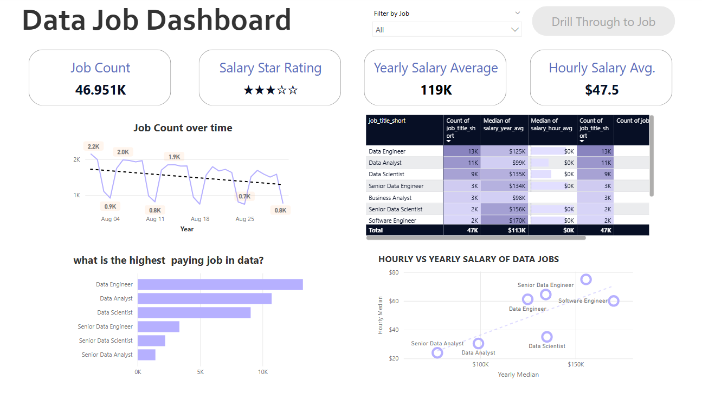

# Data Jobs Dashboard w/Power BI

## Introduction

This dashboard was created for **Job Seekers, Job Transitioners, and Job Swappers** to solve a common problem: information about the data job market is scattered and hard to grasp. Using a *real-world dataset of 2024 data sciense job postings* (including titles, salaries, and locations), this project provides a single, easy-to-use interface to explore market trends and compensation.

## Skills Showcased
- **Data Transformation (ETL) with Power Query:**
Cleaned, shaped, and prepared the raw data for analysis by handling blanks, changing data types, and creating new columns. 
- **Core Charts:** Utilized **Column, Bar, Line,** and **Area Chats** to compare job counts and track trends over time.
- **Dashboard Desgin:** Designed an intuitive and visually appealing layout, exploring both common and uncommon chart types to best tell the data story.
- **Interactive Reporting:**
    - **Slicers:** To dynamically filter the report by Job Title.
    - **Buttons & Bookmarks:** To create a seamless navigation experience.
    - **Drill-Through:** To navigate from a high-keve summary to contextual, detailed view.
    

##Dashboard Overview

This screen serves as a **menu or navigation hub** within Power BI, allowing users to jump between different visualization-related topics or dashboards such as:
Common chart types (bar, columns, line, area, maps, tables)

This Power BI dashboard is designed to **compare job salaries and education requirements** in the data field, answering questions such as:

- Which data jobs pay the most?
- How do salaries differ globally?
- Which jobs require (or don’t require) a degree?

It’s a mix of **salary analytics** and **qualification insights**, helping someone analyze trends in the data job market.

This page provides a **time-based and categorical analysis of the data job market:**

- How job postings change **over time.**
- How **salary and job demand** differ by title.
- How **countries contribute** to the job pool.
- What **job schedule types** dominate.

It gives both **macro trends (yearly/seasonal changes)** and **micro insights (job role salaries & requirements).**

This dashboard focuses on **salary progression and applicant behavior**, featuring:

- **Yearly salary median by quarter**  showing how salaries fluctuate across roles throughout the year.
- **Applicant funnel**  tracking how many candidates move from job posting views to final hiring.
- **Compensation breakdown**  analyzing base, transportation, tax, and total package components.
- **Salary ranges by role**  box plots displaying variation and median salaries for each job type.

It’s designed to connect compensation insights with hiring pipeline dynamics.

This dashboard gives a 2024-focused view of the data job market, including:

- **Job counts over time**  tracking role availability and overall trendline.
- **Job trend analysis** stacked view showing which roles are rising or falling in demand.
- **Role proportions** breakdown of the percentage share of each job type in the market.
- **Salary vs. hourly pay** side-by-side comparison of median yearly and hourly earnings for each role.

It provides a forward-looking analysis of the data jobs ecosystem in 2024.

## Conclusion

This dasboard showcases how Power BI can transform raw job posting data into a powerful tool for career analysis. It allows users to slice, filter, and drill through data to make infromed decisions about their career paths.

